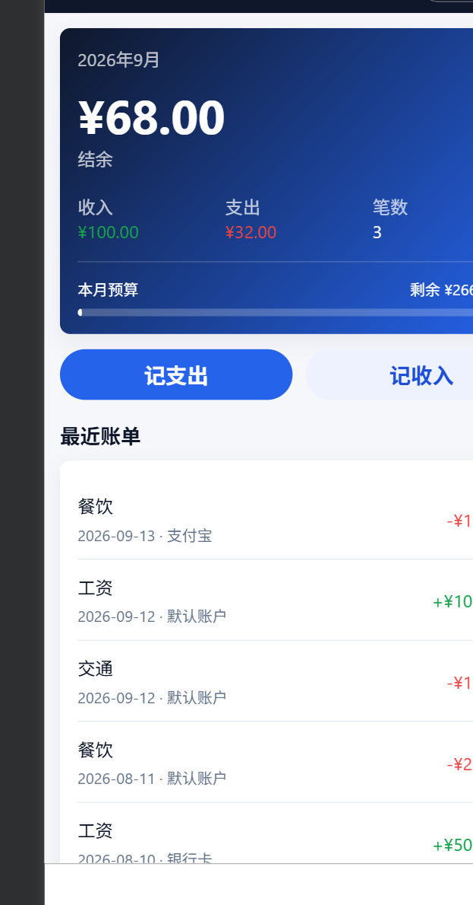

# Accounting

Accounting is a collection of personal accounting products and experiments. It starts with a local-first WeChat Mini Program MVP and uses a monorepo layout so backend services, bill importers, documentation, and future clients can live together.

## Projects

- `apps/wx-accounting-mvp`: a local-first WeChat Mini Program for daily expense and income tracking.

## Screenshots

## Features

- Fast expense and income entry from the home page
- Monthly income, expense, balance, and budget progress
- Bill list with monthly filtering, editing, and deletion
- Category statistics for income and expense
- Custom categories, accounts, and monthly budget
- JSON export/import through the clipboard
- Heuristic CSV import for common payment bill formats

## Current Data Storage

The Mini Program stores data in WeChat local storage on the current device/runtime:

- `wx_accounting_mvp_bills`: bill records
- `wx_accounting_mvp_config`: categories, accounts, and monthly budget
- `wx_accounting_mvp_version`: last local update timestamp

Data is not synced across devices yet. Clearing Mini Program storage will remove local data unless it has been exported.

## Run The Mini Program

1. Open WeChat DevTools.
2. Import `apps/wx-accounting-mvp` as the project directory.
3. Use a test AppID or your own Mini Program AppID.
4. Compile and preview.

## Roadmap

- Stable WeChat Pay and Alipay CSV import adapters
- Category and account sorting/deletion
- Recurring bills
- Go API service for account sync
- AI-assisted category detection and natural language bookkeeping

## License

MIT
